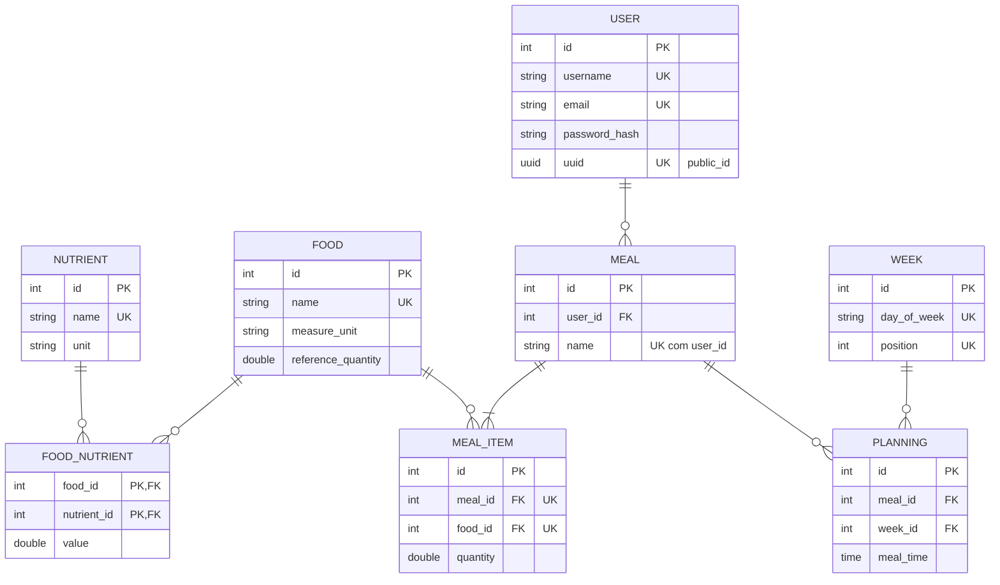

# Modelo de dados - Entity Relationship

```mermaid
erDiagram
    FOOD ||--o{ FOOD_NUTRIENT: " "
    NUTRIENT ||--o{ FOOD_NUTRIENT: " "
    USER ||--o{ MEAL: " "
    MEAL ||--|{ MEAL_ITEM: " "
    FOOD ||--o{ MEAL_ITEM: " "
    WEEK ||--o{ PLANNING: " "
    MEAL ||--o{ PLANNING: " "

    USER {
        int id PK
        string username UK
        string email UK
        string password_hash
        uuid uuid UK "public_id"
    }
    FOOD {
        int id PK
        string name UK
        string measure_unit
        double reference_quantity
    }
    NUTRIENT {
        int id PK
        string name UK
        string unit
    }
    FOOD_NUTRIENT {
        int food_id PK, FK
        int nutrient_id PK, FK
        double value
    }
    MEAL {
        int id PK
        int user_id FK
        string name "UK com user_id"
    }
    MEAL_ITEM {
        int id PK
        int meal_id FK "UK"
        int food_id FK "UK"
        double quantity
    }
    PLANNING {
        int id PK
        int meal_id FK
        int week_id FK
        time meal_time
    }
    WEEK {
        int id PK
        string day_of_week UK
        int position UK
    }
```